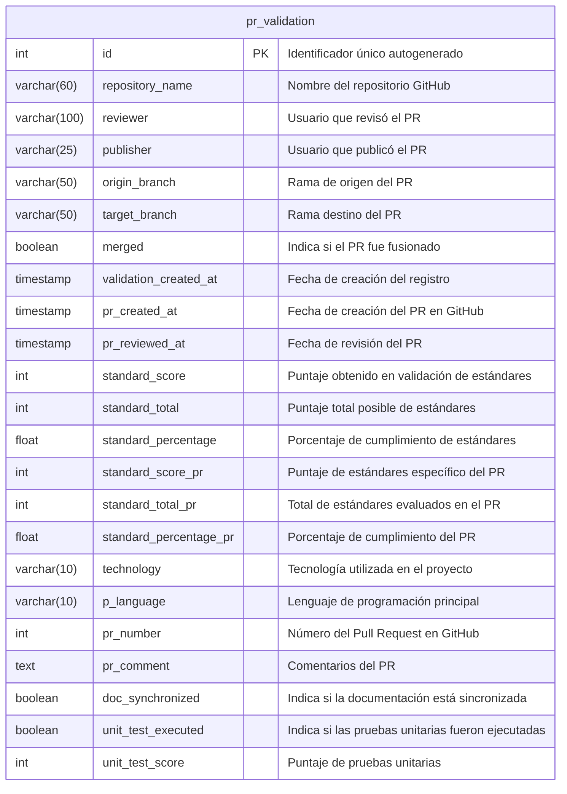

# Bases de datos

## Información General

El proyecto utiliza una base de datos **PostgreSQL** denominada **Prometheus** para almacenar información relacionada con el ciclo de vida de validaciones de Pull Requests en repositorios de GitHub.

**Características de la conexión:**
- **Motor**: PostgreSQL v12 o superior
- **Schema**: `sdlc` (Software Development Life Cycle)
- **ORM**: TypeORM
- **Puerto por defecto**: 5432
- **Soporte SSL**: Configurable (opcional)
- **Sincronización automática**: Deshabilitada (synchronize: false)

La base de datos se utiliza para registrar eventos de Pull Requests capturados desde webhooks de GitHub, almacenando métricas de validación de código, estándares de programación, resultados de pruebas unitarias y estado de sincronización de documentación técnica.

## Diagrama de Base de Datos

## Descripción de Tablas

| Tabla | Descripción | Propósito Principal |
|-------|-------------|---------------------|
| **pr_validation** | Almacena el registro completo de validaciones realizadas a Pull Requests de repositorios GitHub, incluyendo métricas de calidad de código, cumplimiento de estándares y estado de sincronización de documentación. | Centralizar la información histórica de validaciones de PRs para análisis de calidad de código, métricas de cumplimiento de estándares de programación, trazabilidad de cambios y auditoría del proceso de desarrollo en el ciclo SDLC. |

## Relaciones Principales

Actualmente, el modelo de datos consta de una única tabla **pr_validation** que no tiene relaciones explícitas con otras tablas dentro del schema `sdlc` en este proyecto.

**Posibles relaciones lógicas externas** (no implementadas como foreign keys en este proyecto):
- `repository_name`: Podría relacionarse con un catálogo de repositorios
- `publisher` y `reviewer`: Podrían relacionarse con una tabla de usuarios/desarrolladores
- `pr_number` + `repository_name`: Identifican de forma única un Pull Request en GitHub (relación externa con GitHub API)
- `technology` y `p_language`: Podrían relacionarse con catálogos de tecnologías y lenguajes

**Nota**: Esta tabla actúa como un registro independiente que captura snapshots de eventos de Pull Requests para análisis y trazabilidad, sin dependencias relacionales fuertes en la base de datos local.
